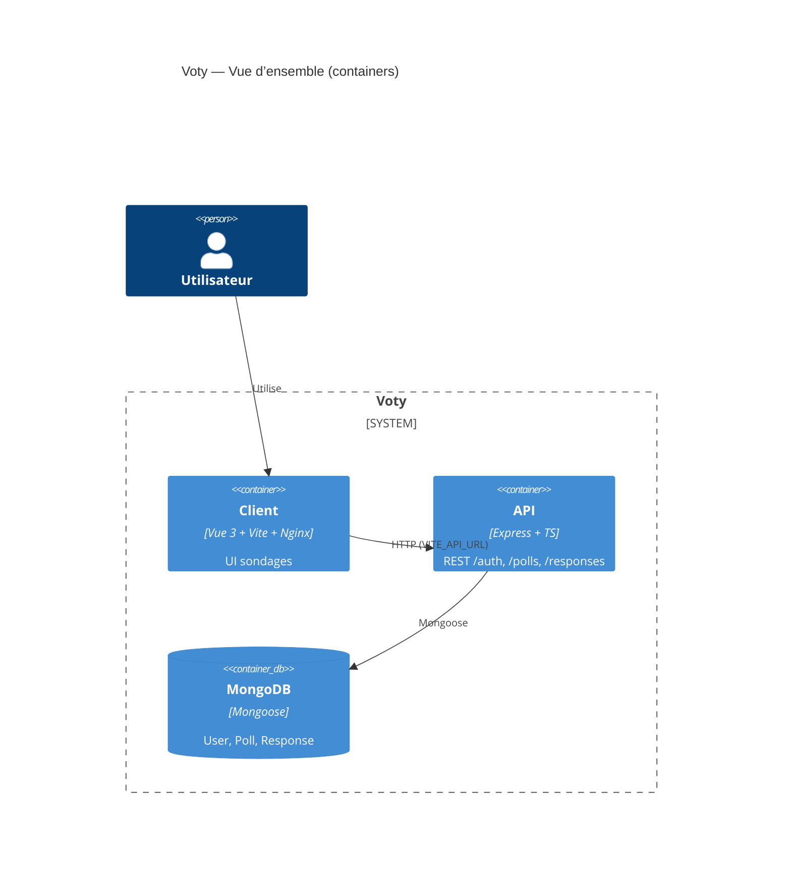
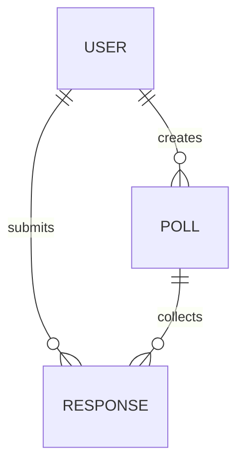

# Dossier projet CDA — Voty

[Sommaire]
- [Page de garde](#page-de-garde)
- [Résumé exécutif](#résumé-exécutif)
- [Cartographie des compétences (CP1 → CP11)](#cartographie-des-compétences-cp1--cp11)
- [Expression des besoins & limites](#expression-des-besoins--limites)
- [Gestion de projet (CP4)](#gestion-de-projet-cp4)
- [Architecture logicielle (AT2)](#architecture-logicielle-at2)
- [Interfaces utilisateur (AT1)](#interfaces-utilisateur-at1)
- [Modèle de données & persistance](#modèle-de-données--persistance)
- [Sécurité applicative](#sécurité-applicative)
- [Plan de tests (AT3)](#plan-de-tests-at3)
- [Déploiement & DevOps (CP10/CP11)](#déploiement--devops-cp10cp11)
- [Endpoints & contrat d’API](#endpoints--contrat-dapi)
- [Journaux, performance & analytique](#journaux-performance--analytique)
- [Risques, dette & décisions d’architecture](#risques-dette--décisions-darchitecture)
- [Gap plan (CP4 / CP8 / CP10 / CP11)](#gap-plan-cp4--cp8--cp10--cp11)
- [Annexes (≤ 40 pages)](#annexes--40-pages)
- [Politique de captures](#politique-de-captures)
- [Final checklists](#final-checklists)
- [Version / Changelog](#version--changelog)

> Rappels REV2 (02/07/2024) — Contraintes officielles du dossier CDA:
> - Le dossier projet doit permettre d’évaluer l’ensemble des compétences sur AT1/AT2/AT3. Oral: 40 min présentation + 45 min entretien technique. Annexes autorisées. 
> - Limites de pages: cœur du dossier 40–60 pages (hors couverture/sommaire/annexes). Annexes ≤ 40 pages. 
> - Structure attendue: expression des besoins, architecture multicouche, maquettes & enchaînement, MCD/MPD, scripts SQL, use cases, séquences, sécurité, plan de tests, jeu d’essai, veille sécurité. 
> - Ce gabarit intègre ces exigences en sections dédiées avec rappels en gras.

# Page de garde
- Projet: Voty
- Auteur: [Votre nom] — Session: [Session] — Coordonnées: [Email] / [Téléphone]
- Contexte RNCP37873 — Titre CDA
- Rappels obligatoires:
  - Présentation: 40 minutes; Entretien technique: 45 minutes. 
  - Volume du dossier: **40–60 pages (hors couverture/sommaire/annexes)**. Annexes: **≤ 40 pages**.
  - Un seul dossier réunissant l’ensemble des projets et preuves (AT1/AT2/AT3).

[ ] Vérifier la pagination conforme aux limites
[ ] Préparer 2 exemplaires papier du dossier projet + 3 exemplaires DP

# Résumé exécutif
- Objectif: Voty permet de créer, publier et répondre à des sondages (questions ouvertes et QCM) pour collecter des retours utilisateurs rapidement.
- Utilisateurs: créateurs de sondages (administrateurs/organisateurs) et répondants.
- Valeur métier: accélérer la prise de décision par la collecte structurée de feedbacks, suivi de la participation et analyse de résultats.
- Portée du dossier: ce document couvre le projet Voty, les choix techniques, l’architecture, la sécurité, les tests et le déploiement.

# Cartographie des compétences (CP1 → CP11)

Rappel: le jury doit pouvoir tracer chaque compétence vers des preuves. Ajouter captures/annexes et commentaires.

- Stack détectée (auto):
  - Front: Vue 3 (^3.3.4), Vite (^4.4.5), Pinia (^3.0.3), Vue Router (^4.5.1), TailwindCSS (^3.4.17)
  - Back: Node.js (20 via CI), Express (^5.1.0), TypeScript (^5.9.2), Mongoose (^8.15.1), Zod (^4.0.14), Helmet (^8.1.0), CORS (^2.8.5), express-xss-sanitizer (^2.0.0), Pino (^9.8.0), Swagger JSDoc (^6.2.8)
  - Tests: Jest (^30.0.5), Supertest (^7.1.4), mongodb-memory-server (^10.2.0)
  - CI/CD: GitHub Actions (deploy-frontend.yml, deploy-backend.yml), Cloudflare Pages, Render deploy hook
  - Conteneurs: Docker Compose (mongo, server, client)

- Références auto-préremplies (liens code):
  - Front (UI/Routes):
    - Router: `client/src/router/index.ts`
    - Composants: `client/src/components/polls/PollView.vue`, `client/src/components/polls/PollRespond.vue`, `client/src/components/polls/PollClosed.vue`, `client/src/components/polls/PollCarousel.vue`
  - Back (Controllers/Routes/Middlewares):
    - Routes: `server/src/routes/authRoutes.ts`, `server/src/routes/pollRoutes.ts`, `server/src/routes/responsesRoutes.ts`, `server/src/routes/healthRoutes.ts`
    - Middlewares: `server/src/middleware/auth.ts`, `server/src/middleware/validate.ts`, `server/src/middleware/asyncHandler.ts`, `server/src/middleware/httpLogger.ts`, `server/src/middleware/attachRequestLogger.ts`, `server/src/middleware/errorHandler.ts` (vérifier/compléter si besoin)
    - Config: `server/src/config/connectDB.ts`, `server/src/config/swagger.ts`, `server/src/config/env.ts`
  - Données (Modèles NoSQL):
    - User: `server/src/auth/models/User.ts` (email unique, hash argon2)
    - Poll: `server/src/polls/models/Poll.ts` (name unique, questions, status)
    - Response: `server/src/responses/models/Response.ts` (answers, refs)
  - CI/CD: `.github/workflows/deploy-frontend.yml`, `.github/workflows/deploy-backend.yml`
  - Infra: `docker-compose.yml`, `client/Dockerfile`, `server/Dockerfile`, `client/nginx.conf`

- Tableau “Compétence → Preuves → Lien code → Captures/Annexes” (à compléter):

| CP | Preuves dans ce dossier | Liens code | Captures / Annexes | Notes |
|---|---|---|---|---|
| CP1 Conception UI | Maquettes, parcours, composants critiques | `client/src/components/...`, `client/src/router/index.ts` | [Capture] écrans clés |  |
| CP2 Dév front | Composants Vue, validation client | `client/src/components/...` | [Capture] UI responsive/A11y |  |
| CP3 Dév back | API REST, services, validations | `server/src/routes/*`, `server/src/*/services/*` | [Capture] Swagger |  |
| CP4 Gestion projet | Kanban, releases, traçabilité | Workflows, README, projets | [Capture] Kanban/Release |  |
| CP5 Données | Modèle Mongoose, index | `server/src/*/models/*` | [Capture] schéma ER |  |
| CP6 Sécurité | AuthN/Z, CORS, headers, XSS | `server/src/middleware/*` | [Capture] ZAP/headers |  |
| CP7 Tests | Plan AT3, Jest, coverage | `server/package.json` | [Capture] rapport tests |  |
| CP8 NoSQL | Modèles + requêtes | `server/src/*/models/*` | [Capture] Atlas/CLI |  |
| CP9 Qualité | Lint/CI checks (si présents) | Workflows | [Capture] pipeline vert |  |
| CP10 Déploiement | Cloudflare Pages/Render | `.github/workflows/*` | [Capture] déploiements |  |
| CP11 Exploit/Obs | Logs Pino, healthchecks | `server/src/middleware/*`, health | [Capture] logs/alerts |  |

- Checklists par CP (extrait):
  - CP2 Front
    - [ ] Tests unitaires de composants UI écrits et exécutables => TODO je n'ai pas encore écrit de tests unitaires pour les composants Vue
    - [ ] Responsive validé (mobile/desktop) => TODO même si la majorité des composants sont responsives
    - [X] Accessibilité de base (roles, labels, tab order) => Composants shacn-ui full accessibles
  - CP3 Back
    - [X] Entrées validées côté serveur (Zod)
    - [X] Swagger exportable (`pnpm -F server export:all`)
    - [X] Erreurs gérées (HTTP codes, messages)
  - CP6 Sécurité
    - [X] CORS restrictif (CLIENT_URL)
    - [X] Headers sécurisés (Helmet)
    - [X] Nettoyage XSS (express-xss-sanitizer)
    - [X] JWT sécurisé (secret, exp)
  - CP8 NoSQL
    - [X] Modèles + index documentés
    - [ ] Backups/exports prévus
    Backup MongoDB Atlas pourrait être envisageable mais nécésite un abonnement payant :
    - Basic backups: Daily snapshots, 8-day retention.
    - Flexible backups: Fully configurable backups with flexible policies.

  - CP10/CP11
    - [X] Pipelines CI/CD tracés (take a look to the workflows)
    - [X] Procédure de déploiement/rollback (pas de rollback mis en place)
    - [X] Observabilité: logs, health, métriques (tout est visible :
       - Cloudflare Pages pour le front (logs, monitoring, stats)
       - Render pour le back (logs pino, healthcheck, monitoring)
       - MangoDB Atlas pour la base de données (stats, logs, monitoring)

# Expression des besoins & limites
- Contexte: collecte d’opinions via sondages en ligne, avec authentification et partage d’URL.
- Personas: créateur (admin/orga), répondant.
- User stories majeures (à adapter):
  - En tant que créateur, je crée un sondage avec des questions [ouverts/QCM].
  - En tant que créateur, je consulte les réponses et des statistiques par sondage.
  - En tant que répondant, je réponds une fois à un sondage et je peux revoir ma réponse.
  - En tant qu’utilisateur, je gère mon compte (nom, email, mot de passe, suppression).
- Hors scope: paiements, analytics avancées, rôles multiples (au-delà de créateur/répondant).

[ ] Lier chaque story aux commits/PRs/tests

# Gestion de projet (CP4)
- Méthode: itérative, incréments fonctionnels, démonstrations régulières.
- Outillage: GitHub (Issues/Projects), Actions, README de runbook, Docker Compose.
- CI pipelines:
  - Front: `.github/workflows/deploy-frontend.yml` (tags client/*.*.* ou dispatch). Build Vite, déploiement Cloudflare Pages via Wrangler.
  - Back: `.github/workflows/deploy-backend.yml` (tags backend/*.*.* ou dispatch). Build, tests Jest, déploiement Render via hook.
- Placeholders de preuves:
  - [Capture] Kanban (colonnes: To Do / In Progress / Done)
  - [Capture] Sprint review / rétrospective
  - [Capture] Burndown chart
  - [Capture] Release notes + artefacts pipeline
- Checklist traçabilité:
  - [ ] Story → Commit → Test → Pipeline → Release
  - [ ] Numéro d’issue dans messages de commit

# Architecture logicielle (AT2)
- Vue d’ensemble (squelette Mermaid):

- Couches & responsabilités:
  - Présentation (Vue): pages/composants, router, état (Pinia).
  - API (Express): routes, contrôleurs, services, middlewares (auth, validate, logs, erreurs).
  - Données (MongoDB): modèles Mongoose, validations de schéma, indexes.
- Sécurité par couche:
  - AuthN/AuthZ: JWT (bearer), middleware `server/src/middleware/auth.ts`.
  - Validation: Zod via `validateBody`.
  - Secrets: .env gérés par dotenv-flow; variables: MONGO_URI, PORT, JWT_SECRET, CLIENT_URL.
  - CORS: `origin: env.CLIENT_URL`.
  - Headers: Helmet; XSS: express-xss-sanitizer.
  - Rate-limit: [TODO] à ajouter si requis.
- Placeholders:
  - [Lien] `server/src/config/env.ts`, `server/Dockerfile`, `client/Dockerfile`, `client/nginx.conf`, `docker-compose.yml`.

# Interfaces utilisateur (AT1)
- Maquettes & enchaînement: [Capture] flux Home → Create → PollView → Réponse.
- Composants critiques:
  - PollView.vue — affichage du sondage.
  - PollRespond.vue — saisie des réponses (validation côté client si applicable).
  - PollClosed.vue — état clôturé.
  - PollCarousel.vue — navigation dans les questions.
- Checklist UI:
  - [ ] Responsive (mobile/desktop)
  - [ ] A11y (labels, contrastes, focus visible)
  - [ ] Conformité charte (typographies, couleurs)

# Modèle de données & persistance
- Relationnel (placeholder si besoin de MPD):

- NoSQL (CP8) — Mongoose:
  - User (`server/src/auth/models/User.ts`)
    - Champs: name (String), email (String, unique), password (String, hash argon2)
    - Index: email unique
  - Poll (`server/src/polls/models/Poll.ts`)
    - Champs: name (String, unique), creator (ObjectId→User), description (String), questions[{ title, type, subType?, options[] }], status (enum)
    - Index: name unique
  - Response (`server/src/responses/models/Response.ts`)
    - Champs: poll_id (ObjectId→Poll), user_id (ObjectId→User), answers[{ question_id, answer: Mixed }]
- Accès données:
  - Services: `server/src/polls/services/pollService.ts`, `server/src/responses/services/responseService.ts`, `server/src/auth/services/*`
  - Erreurs: `HttpError` (si présent) et gestion via `errorHandler`
  - Transactions/atomicité: [TODO] (pas critique ici, éventuellement sessions Mongo)

# Sécurité applicative
- Surface d’attaque:
  - Endpoints REST publics/protégés; JWT bearer; CORS.
- Mesures:
  - Secrets via dotenv-flow (.env.*) — ne jamais committer secrets.
  - CORS limité à CLIENT_URL.
  - Headers sécurité via Helmet.
  - XSS sanitizer global.
  - Validation Zod sur corps de requêtes.
  - Logs corrélés via req.log (pino-http + attachRequestLogger).
- Tests sécurité (placeholders):
  - [ ] ZAP baseline scan => TODO je n'ai pas pas encore mis en place de tests de sécurité ZAP
  - [ ] Tests d’injection (NoSQL, JSON) => TODO je n'ai pas encore mis en place de tests d'injection
  - [ ] Vérification CORS/headers => TODO je n'ai pas pas encore mis en place de tests de sécurité CORS/headers
  - [X] Vérification AuthZ (accès créateur vs répondant) (auth.test.ts)

# Plan de tests (AT3)
- Stratégie: unit (services), intégration (routes via supertest), e2e (Docker stack), perf/sécu (k6/OWASP ZAP — TODO).
- Matrice couverture (story → test): [Tableau à compléter]
- Jeu d’essai représentatif: [Insérer jeux d’entrée/attendu/obtenu] + tableau des écarts.
- Commandes:
  - Backend: `pnpm -F server test` (Jest). Couverture: `pnpm -F server test:all`.
  - Stack Docker: `pnpm stack:up`, `pnpm stack:down`, `pnpm stack:logs`.
- Placeholders rapports:
  - [Capture] rapport tests Jest
  - [Capture] coverage (si activé)
  - [Capture] logs CI

# Déploiement & DevOps (CP10/CP11)
- Pipelines CI/CD:
  - Front (Cloudflare Pages): `.github/workflows/deploy-frontend.yml` — triggers: tags `client/*.*.*` ou `repository_dispatch: deploy-frontend` — build Vite, `wrangler pages deploy`.
  - Back (Render): `.github/workflows/deploy-backend.yml` — triggers: tags `backend/*.*.*` ou `repository_dispatch: deploy-backend` — tests Jest puis POST webhook Render.
- Environnements:
  - Dev: local Docker Compose (http://localhost, API http://localhost:3000/api)
  - Preview/Prod: URLs à renseigner (Cloudflare Pages, Render)
- Procédure de déploiement:
  1) Tag `client/x.y.z` (front) ou `backend/x.y.z` (back)
  2) Actions → pipeline → déploiement auto si succès
  3) Rollback: re-tag version stable / annuler déploiement sur provider
- Observabilité:
  - Logs Pino (niveau, reqId), healthcheck `/api/health`, métriques [TODO]
- Preuves:
  - [Capture] pipeline vert (build/test/deploy)
  - [Capture] tableau des releases
- Mini-projet “visuel” CP10/CP11:
  - [ ] Créer un microservice public (Vercel/Deno Deploy) — endpoint `/status` + page
  - [ ] Ajouter badge build/deploy dans README => TODO
  - [ ] Schéma de flux CI→CD→Prod (Mermaid) 

# Endpoints & contrat d’API
- Base path API: `/api`

| Méthode | URL | Auth | Validation | Codes | Notes |
|---|---|---|---|---|---|
| POST | /auth/register | Public | Zod registerSchema | 201, 400 | Token retour |
| POST | /auth/login | Public | Zod loginSchema | 200, 400 | Token retour |
| GET | /auth/me | Bearer | - | 200, 401 | Profil |
| PUT | /auth/update-name | Bearer | Zod updateNameSchema | 200, 400 |  |
| PUT | /auth/update-email | Bearer | Zod updateEmailSchema | 200, 400 |  |
| PUT | /auth/update-password | Bearer | Zod updatePasswordSchema | 200, 400 |  |
| DELETE | /auth/delete-account | Bearer | Zod deleteAccountSchema | 200, 400 |  |
| GET | /polls | Public | - | 200 | Liste sondages |
| GET | /polls/:id | Public | - | 200, 404 | |
| POST | /polls | Bearer | Zod createPollSchema | 201, 400 | Création |
| PUT | /polls/:id | Bearer | Zod updatePollSchema | 200, 400 | |
| DELETE | /polls/:id | Bearer | - | 200, 400 | |
| GET | /polls/:id/stats | Bearer | - | 200, 403 | Stats créateur |
| POST | /polls/:id/responses | Bearer | Zod submitResponseSchema | 201, 400, 409 | 409 si déjà répondu |
| GET | /polls/:id/responses | Bearer | - | 200, 403 | Créateur seulement |
| PUT | /polls/:id/responses/:responseId | Bearer | Zod updateResponseSchema | 200, 400 | |
| DELETE | /polls/:id/responses/:responseId | Bearer | - | 200, 400 | |
| GET | /polls/users/me/responses/:pollId | Bearer | - | 200, 404 | |
| GET | /health | Public | - | 200, 503 | Readiness DB |

[ ] Générer/exporter Swagger: `pnpm -F server export:all` (swagger.json + postman)

# Journaux, performance & analytique
- Logging: Pino + pino-http, `req.log` injecté (corrélation par requête).
- Niveaux: info/warn/error; pretty en dev (`pino-pretty`).
- Perf (placeholders):
  - [ ] k6/autocannon — scénarios: GET /polls, POST /polls/:id/responses
- ClickHouse (si présent): N/A — [TODO] si besoin d’analytics

# Risques, dette & décisions d’architecture
- ADRs (squelette):
  - [ ] Choix NoSQL (MongoDB) vs SQL
  - [ ] Auth JWT côté API
  - [ ] Déploiement Cloudflare Pages + Render
- Dettes:
  - [ ] Rate limiting et bruteforce protection
  - [ ] Tests e2e front manquants
  - [ ] Monitoring/métriques
- Plan de résorption: prioriser sécurité (rate-limit), tests, observabilité.

# Gap plan (CP4 / CP8 / CP10 / CP11)
- CP8 (NoSQL pas assez visible)
  - What to add:
    - [ ] Capture Atlas/CLI montrant bases/collections/indexes
    - [ ] Tableau des modèles, champs, indexes
    - [ ] Procédure de backup/restore
  - Evidence to capture: schémas Mongoose, requêtes, explain()
  - Where in code: `server/src/*/models/*.ts`, services
  - Done/Not done: [ ] Non fait / [ ] Fait
- CP10 / CP11 (visibilité déploiement/exploitation)
  - What to add:
    - [ ] Microservice public déployé (Vercel/Deno) + URL
    - [ ] Screenshot pipeline + logs de déploiement
    - [ ] Badges build/deploy
  - Evidence to capture: pages Cloudflare, Render dashboard
  - Where in code: `.github/workflows/*`, README
  - Done/Not done: [ ] Non fait / [ ] Fait
- CP4 (clarté gestion de projet)
  - What to add:
    - [ ] Snapshots planning/kanban (Notion/Jira/GitHub Projects)
    - [ ] Traçabilité issue→commit→pipeline→release
  - Evidence to capture: captures Kanban, releases
  - Where in code: workflows, messages de commit
  - Done/Not done: [ ] Non fait / [ ] Fait

# Annexes (≤ 40 pages)
- Dossier annexes/ (captures et preuves):
  - Interfaces clés: “[Capture] Page ___ montrant ___”
  - Extraits de code: chemin exact + numérotation des snippets
  - Schémas (mermaid dans le corps; export PNG si besoin)
  - Rapports CI, coverage, tests sécurité
- Modèle de légende sous chaque figure: Contexte, Objectif, Résultat

# Screenshots policy
- Ne pas intégrer d’images binaires directement dans ce gabarit.
- Ajoutez des TODO explicites:
  - [Capture] Pipeline CI vert (#run XYZ) – montrer les jobs build/test/deploy
  - [Capture] Page UI ___ – démontrer l’accessibilité et la responsivité
  - [Capture] Tableau Atlas/Mongo – prouver la présence NoSQL et rétention

# Final checklists
- Pré-vol soutenance
  - [ ] PC + chargeur, connexion internet
  - [ ] Diaporama (offline OK)
  - [ ] 2 exemplaires papier du dossier projet
  - [ ] 3 exemplaires papier du Dossier Professionnel (DP)
  - [ ] Pièce d’identité
- Conformité REV2
  - [ ] AT1 (UI): maquettes, enchaînement, composants critiques
  - [ ] AT2 (Arch): diagramme global, multicouche, sécurité par couche
  - [ ] AT3 (Tests): stratégie, matrice, jeu d’essai, commandes, rapports
  - [ ] Données: MCD/MPD (si SQL), Mongoose (NoSQL), scripts/migrations
  - [ ] Sécurité: politiques, tests sécu, journaux
  - [ ] CI/CD & Déploiement: pipelines, environnements, rollback, observabilité
  - [ ] Annexes: ≤ 40 pages, bien référencées

# Version / Changelog
- Date: 2025-08-13
- Commit: 2997642
- Notes: Création du gabarit maître du dossier projet CDA (Voty), avec auto-pré-remplissage (stack, endpoints, modèles, CI/CD) et rappels REV2.
